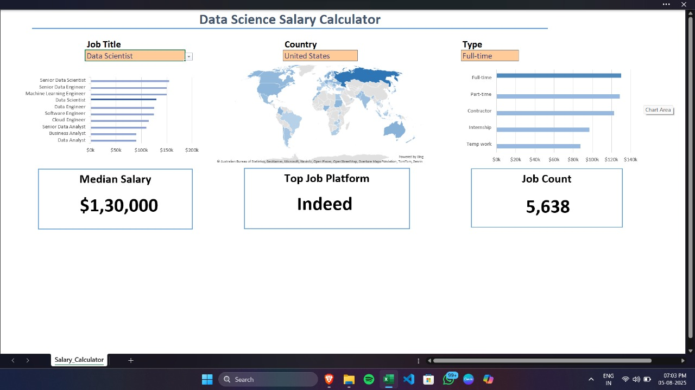

# 📊 Data Science Salary Calculator (Excel Dashboard)

An interactive Excel-based dashboard that allows users to explore and compare salaries across different Data Science-related job titles, employment types, and countries. This project is designed to help job seekers, analysts, and researchers gain insights into global job trends in the field of Data Science.

---

## 🚀 Features

- 🎯 **Dynamic Job Role Selection** – Choose from multiple job titles like Data Scientist, Data Engineer, ML Engineer, etc.
- 🌍 **Country Filter with Geo Map** – Visualize job market distribution across countries.
- 🧾 **Job Type Analysis** – Analyze salaries by job types such as full-time, part-time, internship, contractor, and temp work.
- 💰 **Median Salary Estimation** – Displays the average salary for the selected role and country.
- 📈 **Interactive Charts & Graphs** – Includes bar charts and maps for effective data visualization.
- 📊 **Job Count and Platform Insights** – Know how many jobs are available and on which platform (e.g., Indeed).

---

## 📌 Tools & Technologies

- Microsoft Excel 2021+
- Pivot Tables
- Slicers and Dropdown Filters
- Conditional Formatting
- Geo Chart Map (Powered by Bing)
- Bar Charts and Data Visualization

---

## 💼 Skills Demonstrated

- Data Cleaning and Organization
- Dashboard Creation in Excel
- Data Analysis and Visualization
- UI/UX Thinking in Excel Reports
- Job Market Research

---

## 📸 Screenshot

Here’s a preview of the Data Science Salary Calculator Dashboard:

---

## 📁 Project Structure

📁 Data-Science-Salary-Calculator-Excel/
├── Salary_Calculator.xlsx # Main Excel dashboard
├── README.md # Project documentation
└── project.jpg # Dashboard screenshot

---

## 📚 Use Cases

- Career counseling & salary insights
- Job market data exploration
- Resume/project portfolio enhancement
- Dashboard design in Excel for beginners

---

## 🔗 Connect with Me

Feel free to connect with me on [LinkedIn](https://www.linkedin.com/in/tamilarasan-k-236074303/) or check out more of my work on [GitHub](https://github.com/Tamilarasan-K28/).

---

